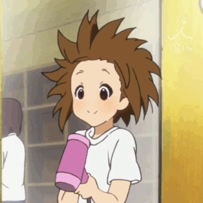

<table>
<tr>
<td width="72%" align="left" valign="middle">

<pre>
Project Manager - Product Design - Strategy Lead
Agentic Builder - UX/UI - Digital systems - Business thinking
React - TypeScript - AI workflows - Product direction
Anime - terminals - quiet nights - products with soul
</pre>

</td>
<td width="28%" align="center" valign="middle">

</td>
</tr>
</table>

✦•······················•✦•······················•✦

### about kero

i'm kero, from mar del plata, argentina.

i work across project management, product design, strategy, and agentic building.  
i like turning business goals into digital products that feel clear, intentional, scalable, and alive.

design, for me, is not decoration.  
it's direction.

✦•······················•✦•······················•✦

### stack + tools

✦•······················•✦•······················•✦

### current focus

- leading product and digital strategy with a strong business lens
- designing ux/ui systems focused on conversion, retention, and clarity
- building agentic workflows and ai-assisted products with real utility
- connecting execution, vision, and product direction across teams and ideas
